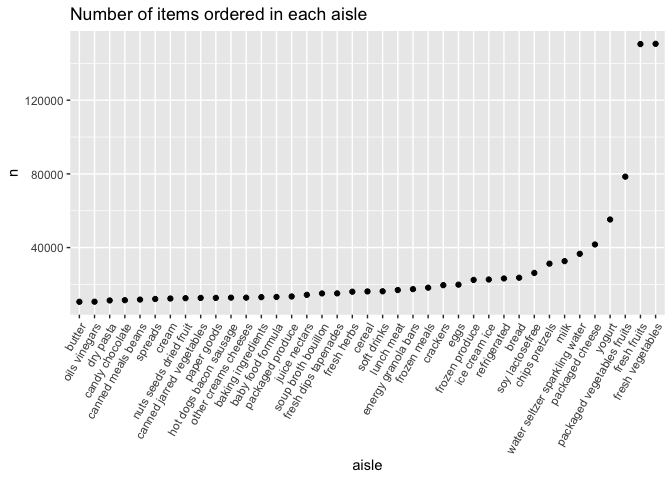
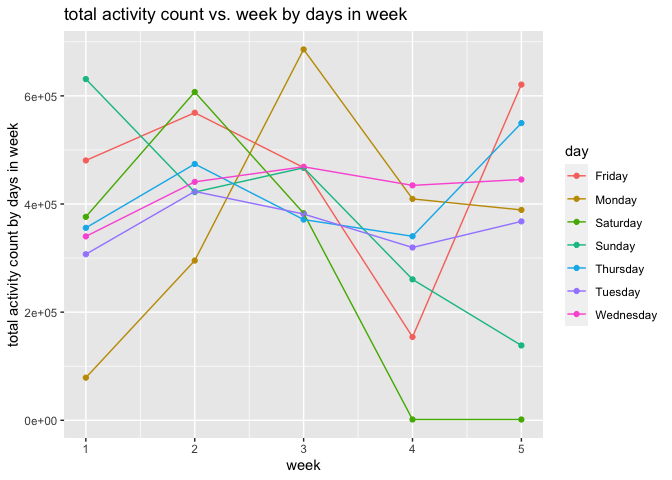
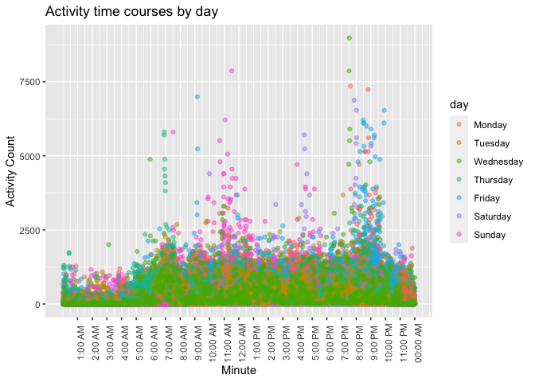

p8105_hw3_jy3270
================
Jingya Yu
2022-10-15

## Set up library

-   library we use

``` r
library(tidyverse)
```

    ## ── Attaching packages ────────────────────────────────── tidyverse 1.3.2.9000 ──
    ## ✔ ggplot2   3.3.6      ✔ dplyr     1.0.10
    ## ✔ tibble    3.1.8      ✔ stringr   1.4.1 
    ## ✔ tidyr     1.2.1      ✔ forcats   0.5.2 
    ## ✔ readr     2.1.2      ✔ lubridate 1.8.0 
    ## ✔ purrr     0.3.4      
    ## ── Conflicts ────────────────────────────────────────── tidyverse_conflicts() ──
    ## ✖ dplyr::filter() masks stats::filter()
    ## ✖ dplyr::lag()    masks stats::lag()

``` r
library(ggridges)
library(patchwork)
library(ggplot2)
library(p8105.datasets)
```

## Probelm 1

``` r
data("instacart")

instacart = 
  instacart %>% 
  as_tibble(instacart)
```

#### Answer questions about the data

This dataset contains 1384617 rows and 15 columns, with each row
resprenting a single product from an instacart order. Variables include
identifiers for user, order, and product; the order in which each
product was added to the cart. There are several order-level variables,
describing the day and time of the order, and number of days since prior
order. Then there are several item-specific variables, describing the
product name (e.g. Yogurt, Avocado), department (e.g. dairy and eggs,
produce), and aisle (e.g. yogurt, fresh fruits), and whether the item
has been ordered by this user in the past. In total, there are 39123
products found in 131209 orders from 131209 distinct users.

Below is a table summarizing the number of items ordered from aisle. In
total, there are 134 aisles, with fresh vegetables and fresh fruits
holding the most items ordered by far.

``` r
instacart %>% 
  count(aisle) %>% 
  arrange(desc(n))
```

    ## # A tibble: 134 × 2
    ##    aisle                              n
    ##    <chr>                          <int>
    ##  1 fresh vegetables              150609
    ##  2 fresh fruits                  150473
    ##  3 packaged vegetables fruits     78493
    ##  4 yogurt                         55240
    ##  5 packaged cheese                41699
    ##  6 water seltzer sparkling water  36617
    ##  7 milk                           32644
    ##  8 chips pretzels                 31269
    ##  9 soy lactosefree                26240
    ## 10 bread                          23635
    ## # … with 124 more rows

Next is a plot that shows the number of items ordered in each aisle.
Here, aisles are ordered by ascending number of items.

``` r
instacart %>% 
  count(aisle) %>% 
  filter(n > 10000) %>% 
  mutate(aisle = fct_reorder(aisle, n)) %>% 
  ggplot(aes(x = aisle, y = n)) + 
  geom_point() + 
  labs(title = "Number of items ordered in each aisle") +
  theme(axis.text.x = element_text(angle = 60, hjust = 1))
```

<!-- -->

Our next table shows the three most popular items in aisles
`baking ingredients`, `dog food care`, and `packaged vegetables fruits`,
and includes the number of times each item is ordered in your table.

``` r
instacart %>% 
  filter(aisle %in% c("baking ingredients", "dog food care", "packaged vegetables fruits")) %>%
  group_by(aisle) %>% 
  count(product_name) %>% 
  mutate(rank = min_rank(desc(n))) %>% 
  filter(rank < 4) %>% 
  arrange(desc(n)) %>%
  knitr::kable()
```

| aisle                      | product_name                                  |    n | rank |
|:---------------------------|:----------------------------------------------|-----:|-----:|
| packaged vegetables fruits | Organic Baby Spinach                          | 9784 |    1 |
| packaged vegetables fruits | Organic Raspberries                           | 5546 |    2 |
| packaged vegetables fruits | Organic Blueberries                           | 4966 |    3 |
| baking ingredients         | Light Brown Sugar                             |  499 |    1 |
| baking ingredients         | Pure Baking Soda                              |  387 |    2 |
| baking ingredients         | Cane Sugar                                    |  336 |    3 |
| dog food care              | Snack Sticks Chicken & Rice Recipe Dog Treats |   30 |    1 |
| dog food care              | Organix Chicken & Brown Rice Recipe           |   28 |    2 |
| dog food care              | Small Dog Biscuits                            |   26 |    3 |

Finally is a table showing the mean hour of the day at which Pink Lady
Apples and Coffee Ice Cream are ordered on each day of the week. This
table has been formatted in an untidy manner for human readers. Pink
Lady Apples are generally purchased slightly earlier in the day than
Coffee Ice Cream, with the exception of day 5.

``` r
instacart %>%
  filter(product_name %in% c("Pink Lady Apples", "Coffee Ice Cream")) %>%
  group_by(product_name, order_dow) %>%
  summarize(mean_hour = mean(order_hour_of_day)) %>%
  spread(key = order_dow, value = mean_hour) %>%
  knitr::kable(digits = 2)
```

    ## `summarise()` has grouped output by 'product_name'. You can override using the
    ## `.groups` argument.

| product_name     |     0 |     1 |     2 |     3 |     4 |     5 |     6 |
|:-----------------|------:|------:|------:|------:|------:|------:|------:|
| Coffee Ice Cream | 13.77 | 14.32 | 15.38 | 15.32 | 15.22 | 12.26 | 13.83 |
| Pink Lady Apples | 13.44 | 11.36 | 11.70 | 14.25 | 11.55 | 12.78 | 11.94 |

## Problem 2

``` r
# loading the data
accel_data <- read_csv(file = "./data/accel_data.csv") %>% janitor::clean_names()
```

    ## Rows: 35 Columns: 1443
    ## ── Column specification ────────────────────────────────────────────────────────
    ## Delimiter: ","
    ## chr    (1): day
    ## dbl (1442): week, day_id, activity.1, activity.2, activity.3, activity.4, ac...
    ## 
    ## ℹ Use `spec()` to retrieve the full column specification for this data.
    ## ℹ Specify the column types or set `show_col_types = FALSE` to quiet this message.

-   Load and tidy the data

``` r
accel_tidy <- accel_data %>%  
  pivot_longer(cols = "activity_1":"activity_1440", 
               names_to = "minute", 
               values_to = "activity_count") %>%
  mutate(
    week_type = ifelse((day == "Saturday" | day == "Sunday"),
     "weekend", "weekday"),
  ) %>%
  select(week,day_id,day,week_type,everything())

head(accel_tidy)
```

    ## # A tibble: 6 × 6
    ##    week day_id day    week_type minute     activity_count
    ##   <dbl>  <dbl> <chr>  <chr>     <chr>               <dbl>
    ## 1     1      1 Friday weekday   activity_1           88.4
    ## 2     1      1 Friday weekday   activity_2           82.2
    ## 3     1      1 Friday weekday   activity_3           64.4
    ## 4     1      1 Friday weekday   activity_4           70.0
    ## 5     1      1 Friday weekday   activity_5           75.0
    ## 6     1      1 Friday weekday   activity_6           66.3

This dataset contains 6 variables, included week, day_id, day,
week_type, minute, and activity counts in each one-minute interval
measured by of a 24-hour day starting from midnight, and collected 50400
observations in total.

-   create a total activity variable for each day

``` r
total_activity =
  accel_tidy %>%
  group_by(week, day) %>%
  summarise(total_activity_counts=sum(activity_count))
```

    ## `summarise()` has grouped output by 'week'. You can override using the
    ## `.groups` argument.

``` r
total_activity
```

    ## # A tibble: 35 × 3
    ## # Groups:   week [5]
    ##     week day       total_activity_counts
    ##    <dbl> <chr>                     <dbl>
    ##  1     1 Friday                  480543.
    ##  2     1 Monday                   78828.
    ##  3     1 Saturday                376254 
    ##  4     1 Sunday                  631105 
    ##  5     1 Thursday                355924.
    ##  6     1 Tuesday                 307094.
    ##  7     1 Wednesday               340115.
    ##  8     2 Friday                  568839 
    ##  9     2 Monday                  295431 
    ## 10     2 Saturday                607175 
    ## # … with 25 more rows

I can’t see any clear trend of activity count.

``` r
total_activity %>%
  ggplot(aes(x = week, y = total_activity_counts, color = day, group = day)) +
  geom_point() +
  geom_line() + 
  labs(y = "total activity count by days in week", 
       title = "total activity count vs. week by days in week")
```

<!-- -->

Still, there are no apparent trend when we focus on the total activity
over the day

-   single-panel plot that shows the 24-hour activity time course for
    each day

``` r
accel_tidy %>%
  mutate(minute = as.integer(sub("activity_","",minute)),
         day = factor(day, levels =
                        c("Monday","Tuesday","Wednesday","Thursday","Friday",
                          "Saturday","Sunday"))) %>%
 ggplot(aes(x = minute, y = activity_count, color = day)) + 
    geom_point(alpha = 0.5) + 
    labs(
    title = "Activity time courses by day",
    x = "Minute",
    y = "Activity Count") +
  scale_x_continuous(
    breaks=c(60,120,180,240,300,360,420,480,540,600,660,720,780,840,900,960,1020,
             1080,1140,1200,1260,1320,1380,1440),
    labels=c("1:00 AM","2:00 AM","3:00 AM","4:00 AM","5:00 AM","6:00 AM",
             "7:00 AM","8:00 AM","9:00 AM","10:00 AM","11:00 AM","12:00 AM",
             "1:00 PM","2:00 PM","3:00 PM","4:00 PM","5:00 PM","6:00 PM","7:00 PM",
             "8:00 PM","9:00 PM","10:00 PM","11:00 PM","00:00 AM")
  ) +
  theme(axis.text.x=element_text(angle = 90))
```

<!-- -->

## Problem 3

-   load in data

``` r
library(p8105.datasets)
noaa_df = data("ny_noaa")
```

This dataset contains rows and columns. Each row representing a single
observation from a New York state weather station from January 1, 1981
to December 31, 2010. Variables include weather station ID (id), date of
observation (date), precipitation in tenths of mm (prcp), snowfall in mm
(snow), snow depth in mm (snwd), maximum temperature in tenths of
degrees C (tmax), and minimum temperature in tenths of degrees C (tmin).
Since each weather station may collect only a subset of these variables,
the resulting dataset contains substantial missing data.
